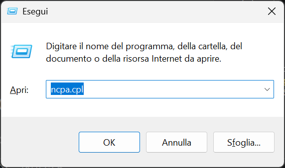
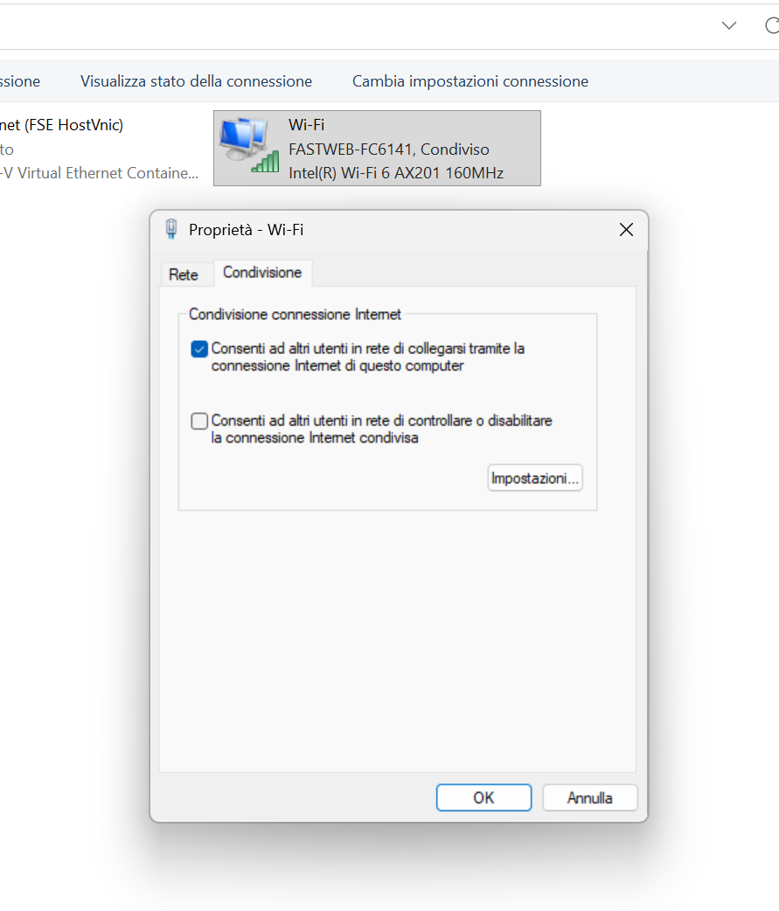
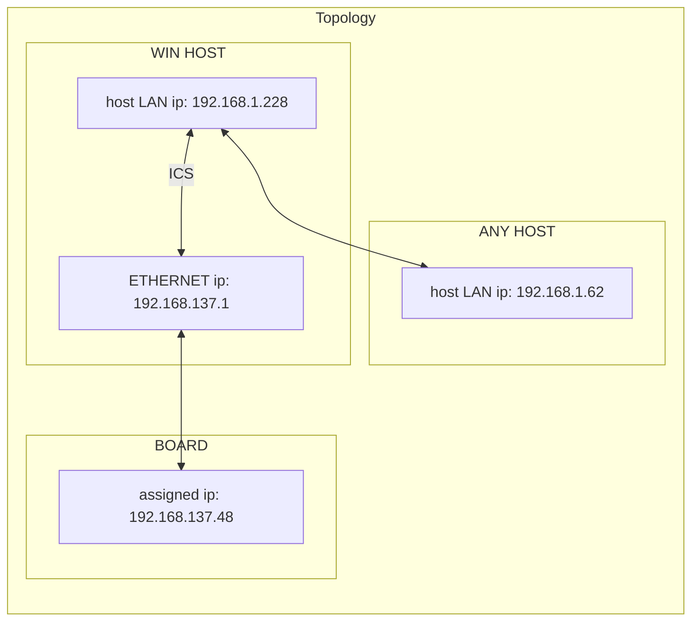

# FIND-IP-PYNQ

This script help to find the correct ip of the board if this has access to Internet via Windows ICS. This WIN feature use DHCP protocol to assing board IP, thus this could be change.

This script accounts dynamic IP in order to automatically connect to the board, also handling ssh config

## Windows

### Requirements
- WIN PC ethernet wired to the board
- ssh and putty installed on PC
- board accessing to Internet via [ICS](https://learn.microsoft.com/en-us/troubleshoot/windows-server/networking/set-up-internet-connection-sharing)
  - <kbd>Win</kbd>+<kbd>r</kbd> and then digit `ncpa.cpl`  
  - ensure you have _ethernet_ and _wifi_ voices 
  - go to _wifi_ voice -> right click -> go to property
  - go to sharing section and activate it like in following photo 
- rust installed at latest version
- pyenv installed
- powershell installed. **Pay attention for permission**, so follow this step:
    - run on powershell terminal this command
        ```
        Get-ExecutionPolicy;
        ```
    - if printed output is `RemoteSigned`, then you are right. Otherwise run this
        ```
        Set-ExecutionPolicy -Scope CurrentUser -ExecutionPolicy RemoteSigned -Force;
        ```
#### windows firewall
- Open **Windows Defender Firewall** -> **Inbound rules** -> You have to create a rule traffic inbound for stream 
- New rule `Allow stream pynq`:
  - port `8080`
  - select scope <local_ip> and <remote_ip>

### Installation from source 
#### create python environment for compiling
- clone repository
```
git clone https://github.com/AleBera03/find-ip-pynq.git
cd ./find-ip-pynq
```
- run these command (create environment)
> NOTE: ensure you have `pyenv` installed
```
pyenv install 3.14
pyenv local 3.14
python -m venv .venv
```
then search for `.python-version` file within repository for double check
- activate env 
```
.\.venv\Scripts\activate.ps1
```
- run this for check python version (if it is equal to the `.python-version` file one)
```
python --version
```
- run compile script
```
.\compile.ps1
```
- final executable is `./find-ip-pynq/dist/set-ip-pynq.exe`

### Installation from release


## Linux (tested on Ubuntu)


### Installation from source


### Installation from release


## Network
Topology with example IPs
